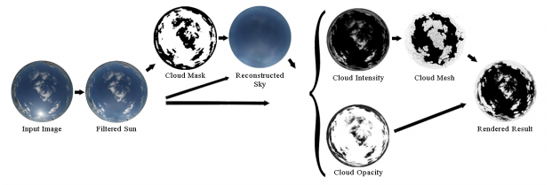

# Clouds-From-Hemispherical-Images
Matlab code for producing cloud meshes from hemispherical images of the sky.

The code is part of the publication [Modeling Clouds from Hemispherical Images](https://www.researchgate.net/profile/Ivan_Nikolov5/publication/292616787_Modelling_of_Clouds_from_a_Hemispherical_Image/links/56b0755c08ae9ea7c3af2192/Modelling-of-Clouds-from-a-Hemispherical-Image.pdf)

The codebase contains the Matlab code for creating the 3D meshes of clouds, as well as the byproduct images - the reconstructed sky, density and opacity maps for the clouds. These are used later on as part of the Unity3D shaders for visualizing the cloud meshes and giving them a more "cloud like" structure. The shaders are also given in the repository.

# Requirements
  - Matlab, but the code can be easily ported to Python+OpenCV, as most of the used image processing and vision fuctions are present there.
  - Unity for visualization of the result point clouds
  
# Using the code

The codebase contains a folder called Input-Images, put all your hemispherical input images there. Four test input images are also given with varying cloud coverage. 
There are two output folders - OutputImages - containing all the in-between images produced by the algorithms, as well as a reconstructed sky, that can be used as a skydome image, plus the density and opacity cloud image maps used with the shaders
The OutputObjects folder contains the build cloud meshes in .obj format. 

To run the algorithm, just open and run the "Function_Holder.m" file.

# Description of the functions

  - vignette.m - crops the image and removes the possible vignetting around the edge of the images. This can be especially pronounced if used with images from sunny days
  - removing_sun.m - detects the part of the image with the highest brighness. It uses a filter color and a threshold value. If nothing is added as input some preset values are used. If the output from this function looks weird, first change the threshold value and if that does not help change the filter color for the sun.
  - create_mask.m - creates a mask for the sky, depending on its color. The result mask has white pixels for the clouds, black for the sky. Morphological operations are done to the mask before outputing it. If not all clouds are captured, do more dilation, etc.
  - reconstruct_sky.m - using k-nearest neighbour and subdividing the sky image into tiles to reconstruct the sky where the clouds were. First it finds the edge points then it uses them to interpolate the holes. The algorithm can fail if the clouds have not been detected fully and there are cloud pixels at the edges, so make sure to expand the mask
  - compute_opacity_intensity.m - computes the opacity and intesity maps of the detected cloud blobs. For this it uses the detected sun pixels, the reconstructed sky pixels and the cloud pixels
  - smoothing.m - smooths the captured point clouds to make it easier to create the mesh representation and remove the jaggedness
  - saveobjmesh.m - the function fixes the warping/curving of the input image and uses it to create and save the meshes.
  
  
